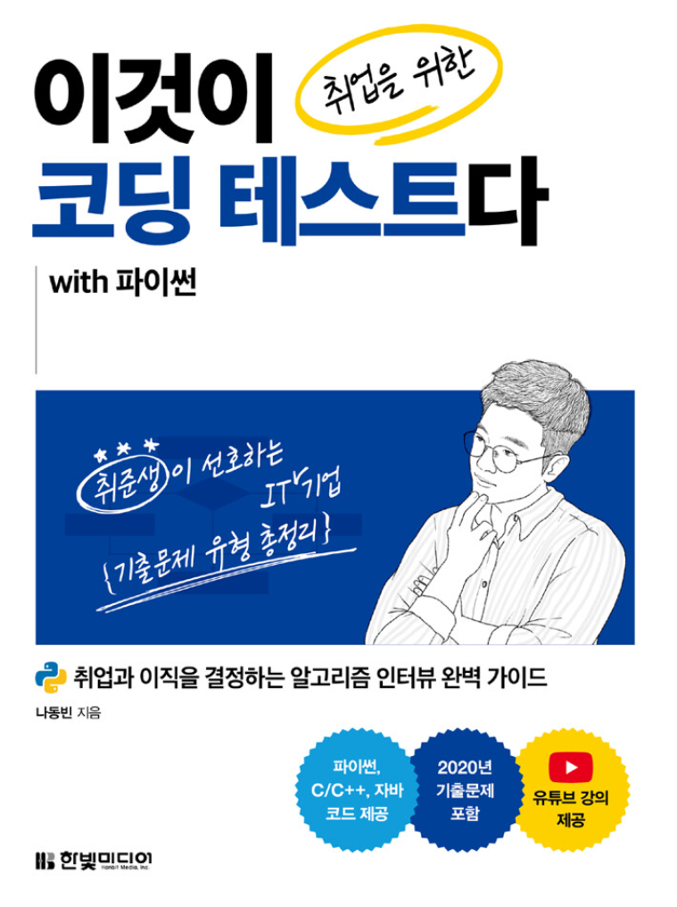

# ⌨️ Algorithm Study for Algorithm Coding Test

	

## The people who studied with me🤝
* 🤝민성[@msio900](https://github.com/msio900)
* 🤝은현[@E-Lux](https://github.com/msio900)
* 🤝영민[@youmn327](https://github.com/youmn327)
* 🤝아연[@climay12](https://github.com/limay12)
* 🤝정화[@junghwa5](https://github.com/junghwa5)
* 🤝나연[@nayeonLeee](https://github.com/nayeonLeee)

## Contents📑

### Part2 : 주요 알고리즘 이론과 실전 문제
  * Chapter 3 : 그리디[👉](./Chap03_greedy)
  * Chapter 4 : 구현(Implementation)[👉](./Chap04_impl)
  * Chapter 5 : DFS/BFS[👉](./Chap05_DFS_BFS.md)
  * Chapter 6 : 정렬 [👉](./Chap06_sorting)
  * Chapter 7 : 이진탐색 [👉](./7_binary_search.md)
  * Chapter 8 : 다이나믹 프로그래밍 [👉](./8_dynamic_programming)
  * Chapter 9 : 최단 경로 [👉](./9_shortest_path)
